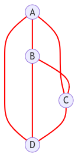
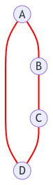
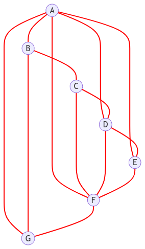

# <div align="center" style="color: red;"><ins align="center" style="color:red"> ___Projet sur les problèmes de la clique maximum___ </ins></div>


## ___Informations sur le code___
- Créateur : <ins>**Samuel**</ins>
- Date due du projet : **14/11/2022** avant **23h59**


### ___Contexte___


```
En informatique, le problème de la clique est un problème algorithmique qui consiste à trouver des cliques (sous-ensembles de sommets d'un graphe tous adjacents les uns aux autres, également appelés sous-graphes complets) dans un graphe. 
Ce problème a plusieurs formulations différentes selon les cliques et les informations sur les cliques devant être trouvées. 
Les formulations courantes du problème de la clique incluent la recherche d'une clique maximum (une clique avec le plus grand nombre possible de sommets), la recherche d'une clique de poids maximal dans un graphe pondéré, la liste de toutes les cliques maximums et la résolution du problème de décision consistant à déterminer si un graphe contient une clique plus grande qu'une taille donnée.
```
*Source : **Wikipedia***


>Une clique de taille 4 dans un graphe de taille 4 est représentable de la façon ci-dessous, tous les sommets sont reliés entre eux:

<div style="text-align:center;"></div>

### ___Fichiers___
- `graphes.py` : Implantation de la classe Graphe qui représente en objet un graphe. Il peut être réprésenté sous différentes formes en fonction du choix de son type (liste adjacente ou matrice) et en fonction du type de ses sommets (nombres ou alphabet). Dans cette classe se trouve des fonctions utiles pour la résolution des problèmes (est_voisin, convertisseur, transformer...). C'est avec l'utilisation de cette classe en paramètre d'autres classes que la résolution des problèmes va être effectuée.
- `graphes_decidabilite.py` : Implantation de la classe Decide qui résout le problème de décidabilité: *__Existe-t-il une clique de taille supérieur à k ?__* Cette classe prend en paramètre la classe Graphe située dans le fichier `graphes.py`.
Dans cette classe se trouve des fonctions utiles pour la résolution du problème de décidabilité (brute_force, tri_brute_force_doublons, est_clique...). 
- `graphes_calculabilite.py` : Implantation de la classe Calcul qui résout le problème de calculabilité: *__Quelle est la plus grande clique d'un graphe pondéré ?__* Cette classe prend en paramètre la classe Decide située dans le fichier `graphes_decidablite.py` pour utiliser la plupart de ses fonctions.
- `rapport.md` : Fichier dans lequel le code est expliqué dans son ensemble.
- `readme.md` : Fichier dans lequel est expliqué quel fichier lancé et certaines façons de le faire
- `rapport.pdf` et `readme.pdf`: Les mêmes fichiers que ceux ci-dessus mais plus lisibles et accessibles à tous
- (dossier) `graphes_images`: Dossier dans lesquel sont stockés les schémas de graphes.


### ___Modules___
- `random` : Ce module permet d'introduire une notion de hasard (dans la mesure du possible) dans le code.
- `string` : Ce module permet de générer une chaine de caractères contenant toutes les lettres de l'alphabet.
- `time` : Ce module permet d'introduire une notion d'attente avant des éxécutions de lignes de codes pour un affichage réussi.


### ___Méthode de résolution des problèmes___
Pour résoudre les problèmes, il est impératif et imposé d'utiliser la brute force: 

>La recherche exhaustive ou recherche par force brute est une méthode algorithmique qui consiste principalement à essayer toutes les solutions possibles.

*Source : **Wikipedia***


```
Ce programme est codé de sorte à d'abord résoudre le problème de décidabilité puis utiliser ses fonctions pour résoudre le problème de calculabilité. 
L'inverse est faisable mais n'a pas été appliqué.
```


## <div align="center" style="color:lightgreen"> ___Problème de décidabilité___ </div>


### ___Explication de la résolution___


``` 
Le problème de décidabilité est un problème qui, résolu, doit retourner vrai ou faux.
Il prend en paramètre un graphe non orienté et k un nombre entier. Il doit vérifier s'il existe une clique de G de taille supérieure à k.


- Il est important de noter l'information ci dessous:
    Il est possible de simplifier la recherche de clique de taille supérieure à k.
    En effet, si une clique de taille k existe, on retorune True.
    Si par contre une clique de taille k n'existe pas, une clique de taille k+1, k+2, k+3... n'existe pas non plus. 
    Il n'y a donc pas le besoin de calculer les cas k+1, k+2... cela optimise grandement le programme.


* On génère d'abord un graphe sous la forme d'une matrice (quel que soit le type de sommets et le type de graphe, le graphe sera converti sous forme de matrice avec des sommets alphabétiques).
* On va ensuite utiliser la fonction est_clique() pour résoudre le problème.
* On va générer tous les chemins possibles de taille k et les stocker dans une liste grace à la fonction brute_force()
* On va trier cette liste pour enlever les répétitions et les doublons grâce à la fonction tri_brute_force_doublons()
    * Pour cela nous allons transformer les lettres en leur index respectifs.
    * En effet, on ne garde que les chemins dont l'index d'un sommet est inférieur à l'index du sommet d'avant: 
    Exemple : ABCB -> 0121; 2 > 1, on ne garde pas ce chemin.
* On va ensuite regarder si pour chaque chemin compris dans la liste, ses sommets sont tous voisins entre eux, c'est à dire s'il existe une clique de taille k.
    * Exemple: ABCD, A->B, A->C, A->D, B->C, B->D, C->D
* S'ils sont tous vosins on retourne True, sinon False.
* Nous avons résolu le problème de décidabilité. Le programme retourne bien True s'il existe une clique de taille supérieure à k et False sinon.
```


### ___Exemple avec instance positive et instance négative___


#### <div align="center"> __Prenons l'exemple d'un graphe sous une forme de matrice avec 4 sommets:__ </div>

    [0,1,0,1]
    [1,0,1,0]
    [0,1,0,1]
    [1,0,1,0]


<div align="center"> Elle est aussi représentable sous cette forme: </div>

<div align="center"> </div>


* __<p style="color:skyblue">Instance positive:</p>__

    * __<div>Existe-il une clique de taille 2 ? :__
<ins style="color: cyan">Oui</ins></div>

            En effet, A et B sont voisins, ils forment donc une clique de 2 éléments.


* __<p style="color:red">Instance négative:</p>__

    * __<div>Existe-il une clique de taille 3 ? :__
<ins style="color: orange">Non</ins></div>
    
            En effet, aucun sommet n'est connecté avec deux autres sommets qui sont connectés entre eux:
            A n'est pas voisin de C.


## <div align="center" style="color:#FF8C00">___Problème de calculabilité___ </div>


### ___Explication de la résolution___

``` 
Le problème de calculabilité est un problème qui, résolu, doit retourner la plus grande clique d'un graphe.
Il prend en paramètre un graphe non orienté. 
On sait qu'une clique existe dans le graphe car 1 seul sommet est une clique à lui seul.


- Il est important de noter l'information ci dessous:
    * Le problème de décidabilité à été résolu avant le problème de calculabilité.
    * Pour résoudre le problème de calculabilité, un grand nombre de fonctions du problème de décidabilité va être utilisé.


* On génère d'abord un graphe sous la forme d'une matrice (quel que soit le type de sommets et le type de graphe, le graphe sera converti sous forme de matrice avec des sommets alphabétiques).
* On va ensuite utiliser la fonction clique_plus_grande() pour résoudre le problème.
* On va faire une boucle dans laquelle qui va de 1 à la taille de la matrice + 2 (pour s'arreter au nombre après la taille de la matrice)
* On va utiliser la fonction est_clique() et allons regarder s'il existe une clique de 1, de 2, de 3... jusqu'à la taille de la matrice + 1.
* Dès que l'on détecte qu'une clique de taille i n'existe pas, on utilise la fonction clique() pour retourner la clique i-1, étant la clique la plus grande.
    Exemple : Soit G un graphe de 7 sommets et la clique la plus grande est de 4 sommets. 
    On regarde si une clique de 1 existe, de 2, de 3, de 4: Oui.
    Par contre dès que l'on teste pour 5, une clique n'existe pas, on retourne donc la clique de 4.
```


### ___Exemple avec instance___


#### <div align="center">__Prenons l'exemple d'un graphe sous une forme de matrice avec 7 sommets:__ </div>


    [0, 1, 0, 1, 1, 1, 1]
    [1, 0, 1, 0, 0, 0, 1]
    [0, 1, 0, 1, 0, 1, 0]
    [1, 0, 1, 0, 1, 1, 0]
    [1, 0, 0, 1, 0, 1, 0]
    [1, 0, 1, 1, 1, 0, 1]
    [1, 1, 0, 0, 0, 1, 0]

<div align="center">Elle est aussi représentable sous cette forme:</div>


<div align="center"></div>


* __<div> Quelle est la clique la plus grande dans cette matrice ? : <ins style="color: cyan">ADEF </ins></div>__

      Une clique de taille 4 est donc présente dans ce graphe.

      En effet A est vosin de D, E et F. 
      D est voisin de E et de F. 
      E est voisin de F; 
      Il y a donc bien une clique de taille 4

